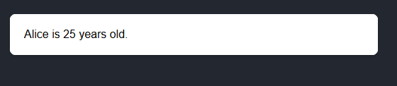

This section will give you a quick guide so you can start building powerful applications with Refract in a few minutes.

## Creating and Nesting Components

Refract apps composed of components. These components are reusable pieces of code that describe how your UI should look and behave.
It can be something small, like a button, or something large, like an entire application.

Components are the fundamental building blocks of your interface. Instead of thinking of your app as one big file of HTML and JavaScript, you split it into small, self-contained pieces (components) that can be reused, combined, and nested.

To create a component, use the `createComponent()` function from Refract.

``` jsx showLineNumbers
import { createComponent } from "refract";

const HelloWorld = createComponent(() => {
  return <h1>Hello, Refract!</h1>;
});

export default HelloWorld;

```
The `createComponent()`  turns your function into a Refract component. Then the function returns markup `(<h1> Hello, Refract!</h1>)`. This markup is rendered whenever you use `<HelloWorld />` in your app.

Check the Component page for more information about Components

## Writing Markup With JSX

Refract uses a JSX-like syntax to describe how your UI should look. JSX (JavaScript XML) is a way of writing HTML-like code inside JavaScript. It makes your components more readable and expressive because the UI structure is written directly in your code.

``` jsx showLineNumbers
import { createComponent } from "refract";

const Welcome = createComponent(() => {
  return (
    <div>
      <h1>Welcome to Refract</h1>
      <p>Build reactive UIs with clarity and ease.</p>
    </div>
  );
});

export default Welcome;

```
Here, `<div>, <h1>, and <p>` look like HTML tags, but they are JSX elements.
They describe the structure of the UI that the component should render.

Check the JSX  page for more information about JSX in Refract.

## Adding Styles

In Refract, you specify a CSS class with `className`. It works the same way as the HTML class attribute:

``` div showLineNumbers
<div className=”about”>About </div>
```
Then you specify the styling in the CSS file:
``` css showLineNumbers
.about{
  color: ‘red'
}
```

## Displaying Data

One of the most common tasks in building user interfaces is displaying data. Whether it’s a simple variable, a list of items, or the result of a function call.

To display any JavaScript value inside your JSX, use the curly braces { }.

``` jsx showLineNumbers
import { createComponent } from "refract";

const UserInfo = createComponent(() => {
  const name = "Alice";
  const age = 25;

  return <p>{name} is {age} years old.</p>;
});

```
**Output**:




## Responding to Events

User interactions are what make applications dynamic and engaging. In Refract, you can respond to events such as clicks, key presses, form submissions, and more using event handler functions.

Event handlers in Refract look very similar to those in React or plain HTML, but they work seamlessly with refractions to update the UI.

To handle an event, attach a function to an element’s event attribute (like `onClick`, `onChange`, or `onSubmit`).

``` jsx showLineNumbers
import { createComponent } from "refract";

const ButtonClick = createComponent(() => {
  function handleClick() {
    alert("Button was clicked!");
  }

  return <button onClick={handleClick}>Click Me</button>;
});

```
When the user clicks the button, `handleClick` is executed.
